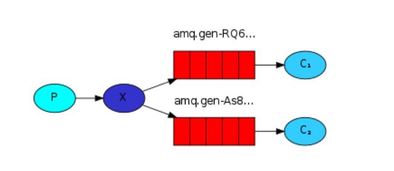
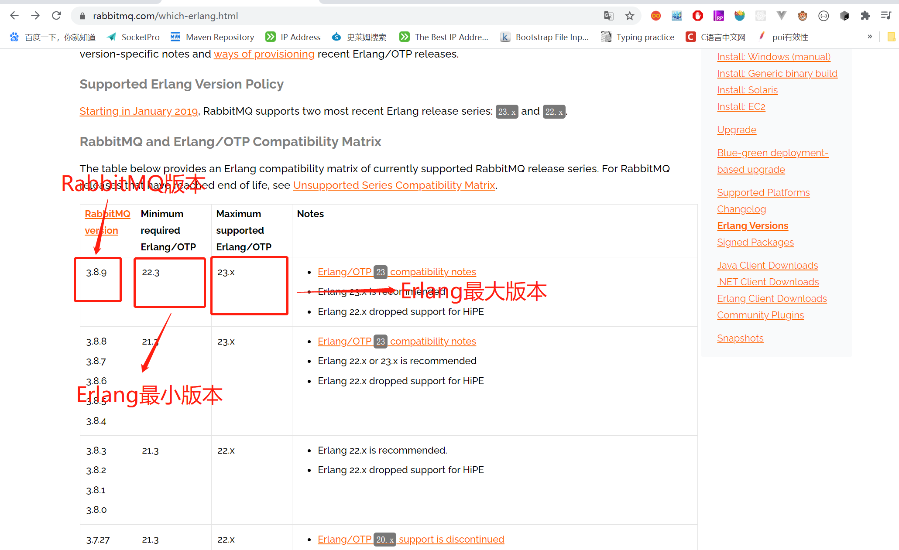
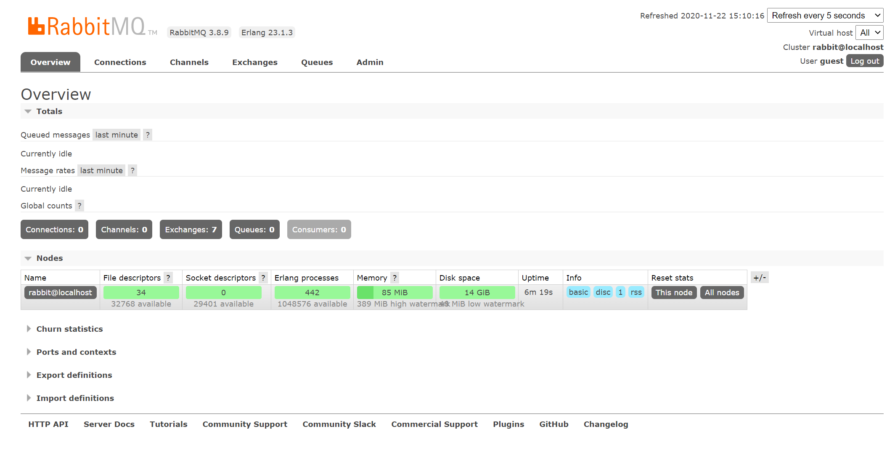

# 消息队列之RabbitMQ

## 1. MQ(Message Queue) 

### 1.1 什么是MQ？

消息队列, 别名消息中间件

生产者、消费者

- 异步通信
- 应用解耦
- 流量削峰
- 消息通讯

### 1.2 有哪些MQ？不同MQ的优劣

- `ActiveMQ`：比较老，性能较差。
- `RocketMQ`：吸收`Kafka`优点，改进缺点，部分功能收费。
- `RabbitMQ`：性能好，可靠性高，完全开源。
- `Kafka`：性能好，但是可靠性低
- ......

## 2. `RabbitMQ`

基于AMPQ协议，`Erlang`语言开发。

- AMPQ：Advanced Message Queuing Protocol（高级消息队列协议），不受客户端/中间件限制，不受开发语言限制。



- `RabbitMQ`四个组件
  - 生产者：发送消息
  - 交换器：传递消息到队列
  - 队列：存储消息
  - 消费者：处理消息

### 2.1 `RabbitMQ`安装

1. 查看对照表Erlang跟RabbitMQ版本对照

   

   2. 下载rpm包

   3. 通过`yum install -y rpm包`安装

      1. 安装Erlang
      2. 安装RabbitMQ

   4. 启动RabbitMQ

      ```shell
      # 启动RabbitMQ
      systemctl start rabbitmq-server.service
      # 查看RabbitMQ状态
      systemctl status rabbltmq-server.service
      # 停止
      systemctl stop rabbitmq-server.service
      # 重启
      systemctl restart rabbitmq-server.service
      ```

      

   5. 安装可视化插件

      ```shell
      rabbitmq-plugins enable rabbitmq_management
      ```

      安装完成之后可以通过`ip:15672`访问，默认账号密码都是`guest`

      此时在本机已经可以访问管理系统了，但是无法正常远程访问。登陆的时候会提示`User can only log in via localhost`

      如果想要远程登录管理系统需要增加配置

      ```shell
      # 新建rabbitmq.config文件
      vim /etc/rabbitmq/rabbitmq.config
      # 写入如下配置
      [{rabbit, [{loopback_users, []}]}]
      ```

      或者是按照官网：

      ```shell
      # 新建rabbitmq.conf文件
      vim /etc/rabbitmq/rabbitmq.conf
      # 添加一行简单的配置
      # DANGER ZONE!
      #
      # allowing remote connections for default user is highly discouraged
      # as it dramatically decreases the security of the system. Delete the user
      # instead and create a new one with generated secure credentials.
      loopback_users = none
      ```
      增加以上之后就可以成功进入rabbitmq管理后台
      

### 2.2 `RabbitMQ`配置


##  3. Java api

1. 与服务器建立一个连接

   ```java
   ConnectionFactory factory = new ConnectionFactory();
   factory.setHost(ip); // 设置主机，默认localhost
   factory.setPort(port);  // 设置端口,默认情况下为-1，在连接的时候根据ssl判断是5671还是5672
   factory.setUsername(username); // 设置用户名，默认guest
   factory.setPassword(password); // 设置连接密码，默认guest
   factory.setVirtualHost(virtualHost); // 设置虚拟主机， 默认“/”
   factory.setUri(URI);  factory.setUri(uriString);  // 根据uri连接
   ```

   

2. `RabbitMQ`消息确认  

   `RabbitMQ`会在收到确认消息之后删除队列中的消。如果消息处理很复杂，需要消耗很长时间，自动确认的情况下，一旦在数据处理中途消费者停止，会发生数据丢失的现象。手动确认可以在数据处理完之后发送一条确认消息，这时候队列再去删除消息就不会丢失数据， 在消费者停止之后，所有未确认的消息会重新发送

   ```java
   boolean autoAck = false;  // true 自动确认  false 手动确认
   channel.basicConsume(TASK_QUEUE_NAME, autoAck, deliverCallback, consumerTag -> { });
   ```

3. 消息持久性

   如果不做任何设置，`RabbitMQ`停止或者崩溃的时候会丢失所有的队列。所以，我们需要把队列跟消息标记为持久的，这时候当`RabbitMQ`重启的时候队列依然存在。

   ```java
   // 设置队列持久性
   boolean durable = true; // ture表示持久保存
   channel.queueDeclare(QUEUE_NAME, durable, false, false, null);
   ```

   *注意：已经存在的队列不可以重新设置不同的参数，否则会返回一个错误。该设置需要同时在生产者与消费者中设置。*

   之后我们还需要将消息设置为持久性的。可以如下将`basicPublish`的props参数设置为`MessageProperties.PPERSISTENT_TEXT_PLAIN`

   ```java
   channel.basicPublish("", QUEUE_NAME, MessageProperties.PERSISTENT_TEXT_PLAIN, message.getBytes());
   ```

4. 公平派遣

   在不做特定配置的情况下，`RabbitMQ`分配任务默认是以轮询的方式分配的。如果两个消费者中有一个一直处理一些复杂的任务，而另外一个的任务则很简单，很快就可以完成。这种情况下就需要做一些配置，保证一个消费者需要同时处理多个任务。

   ```java
   int prefetchCount = 1;
   channel.basicQos(prefetchCount);
   ```

   以上配置保证一个消费者在没有确认上一条消息的前不会被分配到另外一条消息。

5. 发布/订阅模式

   `RabbitMQ`的核心是生产者不会直接发送消息到队列，甚至很多时候生产者并不知道消息是否已经被发送到队列中。

   **交换器：**交换器相当于生产者与消息队列中间的一个中转站，消息通过交换器进入队列。交换器类型可以决定生产者生产的消息是要发给一个队列或是发送给多个队列，或者是需要销毁。

   > **交换器的类型：**
   >
   > 1. `direct`(默认)：根据消息携带的路由键(routing key)将消息投递给对应队列。
   > 2. `fanout`：`fanout`是一种发布/订阅模式的交换器，当发送一条消息的时候，交换器会把消息广播到所有附加到这个交换器的队列上。
   > 3. `topic`：匹配订阅模式。适合用路由键进行消息匹配。
   > 4. `header`：允许匹配AMQP消息的header而非路由键，跟`direct`几乎一样，但性能比较差。

   发布订阅模式需要创建一个`fanout`类型的交换器。

   ```java
   channel.exchangeDeclare(EXCHANGE_NAME, "fanout");
   ```

   `fanout`类型的交换器会将它介绍到的消息广播到所有附加到这个交换器的队列上。

   消息发布的时候需要指定它的交换器：

   ```java
   channel.basicPublish(EXCHANGE_NAME, "", null, message.getBytes());
   ```

6. 临时队列(Temporary queues)

   大多数情况下，我们需要给队列指定一个特定的名称以便我们在生产者跟消费者之间分享消息。但在某些情况下，比如日志管理中，我们希望了解所有的日志消息，而不是其中一个子集。而且我们只会关注当时正在进行的日志，对于旧的日志我们不需要过多的关注。这种情况下我们就需要下面一些设置：

   - 不管我们什么时候连接到RabbitMQ，我们都需要一个新的空队列，所以我们需要创建一个随机名称的队列，最好是让服务器为我们随机分配一个队列名称。
   - 一旦我们关闭连接的时候需要自动删除该队列。

   

